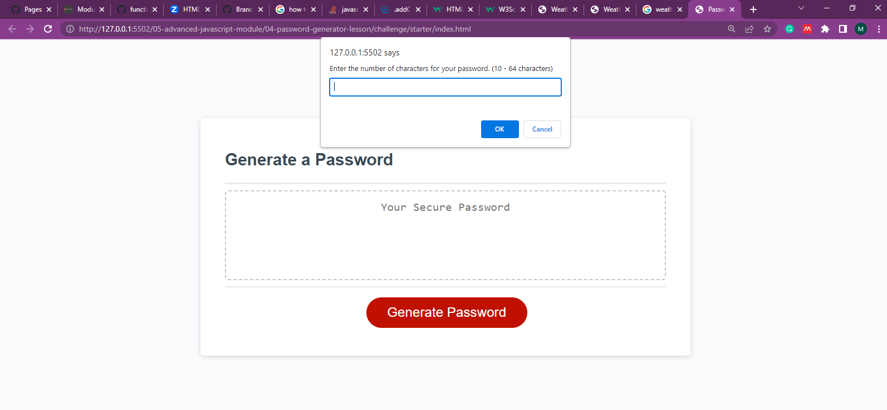

# Password Generator

This app generates a random password from a user's input. The password is of length 10-64 and includes numbers, letters, and special characters.

The app  runs in the browser  and features dynamically updates HTML and CSS powered by JavaScript code that will be written.

The following image shows the web application's appearance and functionality of the completed work.

This is the completed app.

---

© 2022 edX Boot Camps LLC. Confidential and Proprietary. All Rights Reserved.
